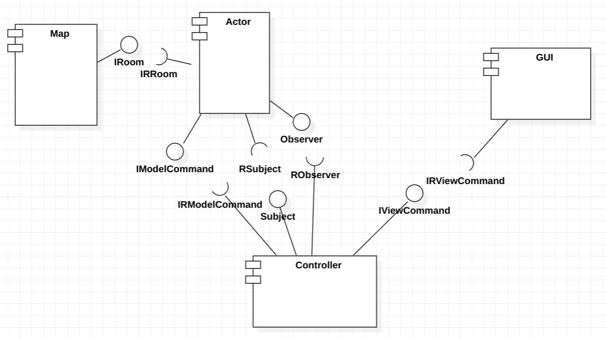

# Projeto Ben10 - O Resgate do Vô Max

# Descrição Resumida do Jogo

> Ben10 - O Resgate do Vô Max é um jogo SinglePlayer com interface gráfica, no qual o usuário controla
> o personagem do Ben10 e precisa atravessar um mapa com inimigos e obstáculos para encontrar no fim
> encontrar o seu Vô Max, que foi capturado pelo exército do Vilgax - maior inimigo do Ben.
> Nesse mapa, o Ben pode se transformar em 3 aliens com diferentes habilidades para conseguir vencer as
> dificuldades que encontrará no jogo, como inimigos, barreiras, lavas, etc.

# Equipe
* João Vitor Mendes - 237881
* Tiago Perrupato Antunes - 194058

# Arquivo Executável do Jogo

> Coloque aqui um link para download do arquivo `jar` ou equivalente para execução do seu jogo.

# Slides do Projeto

## Slides da Prévia
> Coloque um link para os slides da prévia do projeto.

## Slides da Apresentação Final
> Coloque um link para os slides da apresentação final do projeto.

# Diagramas

## Diagrama Geral da Arquitetura do Jogo

