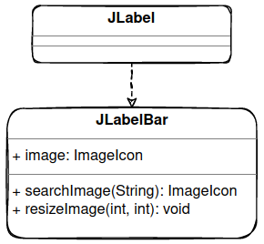
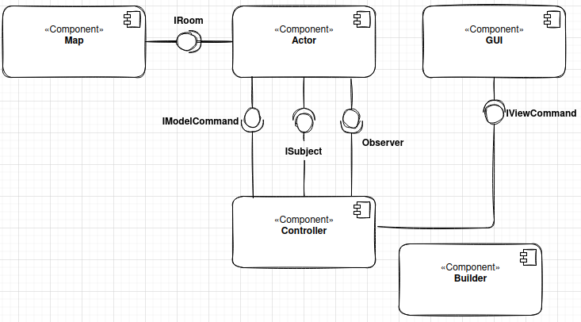
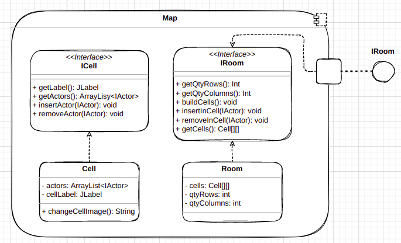
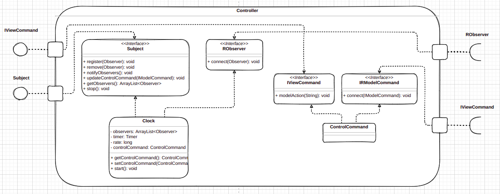

# Projeto Ben10 - O Resgate do Vô Max

# Descrição Resumida do Jogo

> Ben10 - O Resgate do Vô Max é um jogo SinglePlayer com interface gráfica, no qual o usuário controla
> o personagem do Ben10 e precisa atravessar um mapa com inimigos e obstáculos para encontrar, no fim,
> o seu Vô Max, o qual foi capturado pelo exército do Vilgax - maior inimigo do Ben.
> Nesse mapa, o Ben pode se transformar em 3 aliens com diferentes habilidades para conseguir vencer as
> dificuldades que encontrará, como inimigos, barreiras, lavas, entre outros.

# Equipe
* João Vitor Mendes - 237881
* Tiago Perrupato Antunes - 194058

# Arquivo Executável do Jogo

[Arquivo de Execução](src)

# Slides do Projeto

## Slides da Prévia
[Apresentação Prévia](https://docs.google.com/presentation/d/1v5TwfmChBDbcDMfF0BYvcyM1QLm0bJLEDFVNppqKK94/edit#slide=id.gf44d104c1d_0_0)

## Slides da Apresentação Final
[Apresentação Final](https://docs.google.com/presentation/d/1fnlEZBUQYlsOXYLzwsBtNStBU6_5quMfQ67F_xklCNU/edit#slide=id.g12ef4f3d213_3_5)

## Relatório de Evolução

> No inicio da criação da arquitetura do projeto, foi planejado utilizar a atualização de todos atores dinâmicos a partir de um temporizador por um Thread interno em cada ator. Pórem ao finalizar a arquitetura do pojeto, o plano foi mudado para a utilização do padrão de projeto Observer e a criação da classe Clock, responsável por manejar o tempo.

.png)

> Foi desenvolvido um classe unica GUI responsável por criar toda a interface gráfica, essa classe não ficou da melhor maneira possível visto que todas os containers foram criadas pela instancia nativas do java (JLabel, JButtom, etc). Porém, ao implementar as barras de vida e estamina na interface, foi criado uma classe JLabelBar que herda JLabel, desta forma o código ficou muito mais limpo e legível. 
A ideia seria implementar essa mudança em toda interface gráfica, porém, devido a falta de tempo não foi possível fazer tal melhoria.

> No inicio do projeto, foi planejado instanciar todas as celulas do jogo dentro do view do projeto. Porém, foi decidido manejar essa parte do código dentro da própria celula e passar o ponteiro desse JLabel para a classe GUI.
Assim, quando o modelo for atualizado, a interface gráfica será atualizada automaticamente.

~~~java
    ...
	public Cell() {	
		this.actors = new ArrayList<IActor>();
		this.cellLabel=new JLabel();
		this.cellLabel.setPreferredSize(new Dimension(IMAGE_WEIGHT,IMAGE_HEIGHT));	
	}
    ...
~~~

> No desenvolvimento da arquitetura, uma dificuldade encontrada foi na representação dos 4 tipos de herois joagáveis (ben10, flames, fourarms e diamond), no inicio foi planejado criar uma classe pai "Ben10" e 3 subclasses representando cada alien, já que esses aliens teriam habilidades a mais que o proprio personagem principal. Então foi desenvolvida a seguinte estrutura.

> Pórem, foi encontrado certa dificuldade em implementar esses personagens e transitar por eles durante o jogo. Então foi feita uma arquitetura na qual uma classe pai "Hero" seria herdada pelos 4 herois jogáveis para tornar possível essas transições.

# Destaques de Código

## Implementação de um Clock Universal

> Para automatizar algumas mecânicas do jogo com o tempo, foi criado um objeto que sempre, a partir de um tempo predeterminado, chama os atores envolvidos para se atualizarem. Tornando o jogo mais fluido e dinâmico.

~~~java
// Implementação do Clock
public class Clock implements Subject {
	private ArrayList<Observer> observers;
	private Timer timer;
	private long rate;
	private ControlCommand controlCommand;
	
	public Clock(int rate) {
		this.observers = new ArrayList<Observer>();
		this.rate=rate;
		this.timer=new Timer();
	}

    ...

    // inicia o Clock
	public void start() {
		this.timer.scheduleAtFixedRate(new TimerTask() {
		public void run() {notifyObservers();}  // notifica os atores envolvidos
		}, this.rate, this.rate);
	}

    ...
}
~~~

## Troca de Heróis

> Sempre que o usuário pede pra trocar de herói, existe uma função que faz a dinâmica de atualizar alguns parâmetros para ativar e desativar heróis, além de fazer a comunicação entre o command e o novo herói.

~~~java
/* troca de personagem a depender do comando
 * retorna esse personagem novo
 */
public Hero changeHero(String command) {
    
    this.remove();
    this.setTransformed(false);
    for (int i = 0; i < this.getHeros().length; i++) {
        Hero hero = this.getHeros()[i];
        if (hero.getTypeActor().equals(command)) {
            hero.setPosRow(this.getPosRow());
            hero.setPosColumn(this.getPosColumn());
            hero.setTransformed(true);
            hero.connect(this.getRoom());
            hero.insert();
            return hero;
        }	
    }
    
    return null;
}
~~~

## Inimigos com Tomadas de Decisão Inteligentes

> Os inimigos possuem um campo de visão e, a partir dele, procuram o ben10 e tomar decisões de movimentação e ataque. Essas tomadas de decisões sempre acontecem quando o Clock chama o seu update. 

~~~java
// define sua estrategia de movimentação e ataque a cada clock (exemplo do NearEnemy)
public void update() {
    Hero hero = searchHero();
    if(hero!=null){
        
        int rowDist=this.getPosRow() - hero.getPosRow();
        int columnDist=this.getPosColumn() - hero.getPosColumn();
        // caso esteja nas casas adjacentes ele ataca
        if ((rowDist == 1 || rowDist == -1) && columnDist == 0
                || (columnDist == 1 || columnDist == -1) && rowDist == 0){
            attack();
        }
        //deixa o movimento mais aleatorio
        Random randomMove = new Random();
        switch(randomMove.nextInt(2)) {
            //da preferencia aos movimentos do entre as linhas
            case 0:
                if(rowDist>0) {
                    if(verifyMovement("forward")) {
                        move("forward");
                    }
                }

                ...

                break;
        }
    }
}
~~~

## Estamina dos Heróis
> Cada heroi tem uma estamina própria que, quando este é ativado, sua estamina decresce com o tempo e, caso chegue em zero, o jogador volta a ser o Ben10, perdendo a chance de usar habilidades do heroi que estava usando. Quando um heroi não está ativado, a estamina volta a crescer até chegar no máximo novamente ou  até o heroi ser ativado pelo jogador novamente.

~~~java
public class Hero extends Actor implements IHero {
	
	...

	private int stamina = 10;
	
    ...

	private boolean isTransformed = false;

    // com o tempo, o hero recebe uma chamada do Clock para ele se atualizar, fazendo a dinâmica da estamina
    public void update() {
        if(this.getTypeActor() != "B10") {
            Hero hero=this;
            if((hero.isTransformed) && (hero.getStamina() > 0)) {
                hero.setStamina(hero.getStamina() - 1);				
            }
            else if(!(hero.isTransformed) && (hero.getStamina() < 10)){
                hero.setStamina(hero.getStamina() + 1);
            }
        }
    }
    // arruma a stamina do heroi e caso chegue em zero, força a mudança para o Ben10
	public void setStamina(int stamina) {
		this.stamina = stamina;
		this.getLabel().resizeImage(stamina*12 + 1,BAR_HEIGHT);
		if(stamina==0) {
			this.getSubject().updateControlCommand(this.changeHero("B10"));
		}
	}
}
~~~

# Destaques de Orientação a Objetos

## Herança dos Heróis no jogo

> Os heróis do jogo são classes herdeiras de uma superclasse Hero que centraliza algumas funções e habilidades deles. Por sua vez a classe Hero é herdeira da classe Actor que é responsável por fazer a comunicação com as células do mapa

~~~java
// Hero herdeira de Actor
public class Hero extends Actor implements IHero {
	
	private static int life = 10;
	private int stamina = 10;
    private static boolean win = false;
	private static Subject clock;
	private static Hero heros[];
	private boolean isTransformed=false;
	private String aim;

    ...
	
	public Hero(int posRow, int posColumn, String typeActor) {
		
		super(posRow, posColumn, typeActor);
		this.aim = "right";		
		
        ...

	}
}

// Exemplo do Ben10 que é herdeiro do Hero
public class Ben10 extends Hero {

	public Ben10(int posRow, int posColumn, String typeActor) {
		super(posRow, posColumn, typeActor);
		this.setTransformed(true);
	}
}
~~~

## Polimorfismo
### Movimentação de Atores na Sala

> Os atores são instanciados como classes específicas de cada um, mas como todas são herdeiras de Actor, a inserção e remoção de atores nas células é feita considerando que os objetos são Actors.

~~~java
// declara como Actor e instancia como classes específica
public void createActor(int posRow, int posColumn, String actorType) {
    
    IActor obj;
    
    switch (actorType) {

    ...
        
    case "NE":
        obj = new NearEnemy(posRow, posColumn, actorType);
        break;
    
    case "DE":
        obj = new DistantEnemy(posRow, posColumn, actorType);
        break;
        
    ...
        
    default:
        return;
    }
    
    ...
}

// coloca os atores nas celulas como atores no geral pelo ArrayList
public class Cell implements ICell {
	
	private ArrayList<IActor> actors;

    ...
	
	public Cell() {
		
		this.actors = new ArrayList<IActor>();
		
        ...
		
	}

    ...
}
~~~

### Vetor de Heróis em cada Herói

> Heróis são instanciados em suas classes específicas, mas declarados como Hero, então eles podem tanto ser adicionados nas células como guardados como referência no vetor de Heros que todos os heróis compartilham

~~~java
// cria todos os herois
public void createHeros(int posRow, int posColumn) {
    
    //instancia todos os herois
    Hero ben10 = new Ben10(posRow, posColumn, "B10");
    Hero fourArms = new FourArms(posRow, posColumn, "FA");
    Hero flames = new Flames(posRow, posColumn, "FL");
    Hero diamond = new Diamond(posRow, posColumn, "DI");

    //coloca eles em um vetor para cada um ter acesso aos outros herois
    Hero heros[] = {ben10, fourArms, flames, diamond};
    this.heros=heros;
    ben10.setHeros(heros);
    fourArms.setHeros(heros);
    flames.setHeros(heros);
    diamond.setHeros(heros);

    ...
}

public class Hero extends Actor implements IHero {
	
	...
    // vetor com todos os heros
	private static Hero heros[];

    ...
}
~~~

# Destaques de Pattern
## Strategy

> Alguns atores do jogo possuem estratégias de jogo como movimentação e ataque, assim, o design pattern do tipo Strategy fo implementado para organizar essas implementações de habilidades. No caso, todo agente que implementa esses strategies implementam uma interface geral DynamicActors que junta essas Strategies.

## Código do Pattern
~~~java
// strategy de movimentação
public interface MovementStrategy {
	
	public void move(String direction);
	public boolean verifyMovement(String direction);
}

// strategy de ataque
public interface AttackStrategy {
	
	public void attack();
}

// a interface dynamicActor herda as estratégias
public interface DynamicActor extends Observer, RSubject, AttackStrategy, MovementStrategy {
	
	public void disconnectToClock(Observer target);
}

// os herois vão implementar elas
public interface IHero extends DynamicActor, IModelCommand {
	
    ...

}

// os inimigos também implementam elas
public interface INearEnemy extends DynamicActor {}

public interface IDistantEnemy extends DynamicActor {}
~~~

> Como cada ator implementa as strategies da sua forma, é possível padronizar as chamadas delas durante a mecânica do jogo, pois, devido a sobrecarga de métodos, para uma mesma assinatura de método, cada objeto executa sua própria estratégia. Permitindo um código e estrutura de código mais organizada.

## Observer

> Para implementar o Clock Universal no jogo, foi usado o design pattern de Observer para sempre que o Clock der um tempo t, ele chamar todos os objetos que dependem dele para se atualizarem.

### Diagrama do Observer no Actor

### Diagrama do Observer no Clock

~~~java
// interface de Subject
public interface Subject {
	
	public void register(Observer obj);
	public void remove(Observer obj);
	public void notifyObservers();
	public void updateControlCommand(IModelCommand hero);
	public ArrayList<Observer> getObservers();
	public void stop();
}
// interface para conectar um observer no subject
public interface RObserver {
	
	public void connect(Observer obj);
}
// o Clock vai ter um ArrayList de Observers e notificá-los sempre que precisarem se atualizar
public class Clock implements Subject {
	private ArrayList<Observer> observers;
	private Timer timer;
	
    ...
    
}

// cada observer vai implementar essa interface
public interface Observer {
	
	public void update();
	public void setSubject(Subject obj);
	public Subject getSubject();
	public String getTypeActor();
	public boolean isAlive();
}
// coloca um ponteiro do subject no Observer
public interface RSubject {
	
	public void connect(Subject subj);
}

// exemplo de um inimigo que atua como observer (NearEnemy)
public interface DynamicActor extends Observer, RSubject, AttackStrategy, MovementStrategy {
	
	public void disconnectToClock(Observer target);
}
// vai implementar as funções na sua classe
public interface INearEnemy extends DynamicActor {}
~~~

> A implementação desse pattern permite centralizar a chamada de update sempre que o clock precisa, basta que o observer esteja no seu ArrayList. Essa dinâmica permite que os inimigos se movimentem sozinhos, ataquem, além de criar toda a dinâmica de estamina dos alienígenas, fazendo a dinâmica do jogador voltar a ser o Ben10 depois de um tempo

# Conclusões e Trabalhos Futuros

> No fim foi obtido ótimos resultados, os elementos do jogo se interagiram muito bem a partir do clock e do polimorfismo entre os atores que herdavam a classe Actor.

>

> Apresente aqui as conclusões do projeto e propostas de trabalho futuro. Esta é a oportunidade em que você pode indicar melhorias no projeto a partir de lições aprendidas e conhecimentos adquiridos durante a realização do projeto, mas que não puderam ser implementadas por questões de tempo. Por exemplo, há design patterns aprendidos no final do curso que provavelmente não puderam ser implementados no jogo -- este é o espaço onde você pode apresentar como aplicaria o pattern no futuro para melhorar o jogo.

# Documentação dos Componentes

# Diagramas

## Diagrama Geral da Arquitetura do Jogo

> Diagrama geral da arquitetura do jogo, com todos os metodos de todas as classes. Baixe a imagem e de zoom para melhor visualização.
> A arquitetura foi baseada no modelo MVC de projeto. Na parte do Model temos os componentes `Map` e `Actor`, na parte do Controller estão os componentes `Controller` e `Builder`. Por fim, no View está o componente `GUI`.
> A comunicação entre esses componentes e majoritariamente feita por interfaces. 

## Diagrama Geral de Componentes

## Componente `Actor`

> O Componente Actor tem o papel de unificar todos os atores que estão presentes no jogo. Desde atores dinâmicos independentes, jogador, até atores estáticos. Ele oferece serviços de comunicação com o CommandControl - responsável por controlar os comandos enviados para o jogador e pelo Clock -, permitindo os atores executarem habilidades durante o jogo. Além disso, ele oforece uma comunicação com o Map - responsável por representar a sala de jogo, que por sua vez é apresentada pelo View na interface gráfica.

**Ficha Técnica**
Item | Detalhamento
----- | -----
Classe | `model.actors`
Autores | `João Vitor Mendes`   `Tiago Perrupato Antunes` 
Interfaces | `Observer`  `IModelCommand`   `RSubject`   `IRRoom`

### Interfaces

Diagramas:

Código Java:

~~~java
public interface Observer {
	
	public void update();
	public void setSubject(Subject obj);
	public Subject getSubject();
	public String getTypeActor();
	public boolean isAlive();
}
///////////////////////////////////////////////
public interface IModelCommand {
	
	public Hero executeCommand(String command);
}
///////////////////////////////////////////////
public interface RSubject {
	
	public void connect(Subject subj);
}
///////////////////////////////////////////////
public interface IRRoom {
	
	public void connect(IRoom room);
}
~~~

## Componente `Map`

> O Componente Map tem o papel de representar a sala de jogo com suas células. Em cada célula é possível guardar atores que se movimentam e interagem entre si. O serviço desse componente se define em se comunicar com cada ator do jogo para permitir a sua mudança de posição, inserção ou remoção.

**Ficha Técnica**
item | detalhamento
----- | -----
Classe | `model.map`
Autores | `João Vitor Mendes`   `Tiago Perrupato Antunes` 
Interfaces | `IRoom`

### Interfaces

Diagrama:

Código:

~~~java
public interface IRoom {
	
	public int getQtyRows();
	public int getQtyColumns();
	public void buildCells();
	public void insertInCell(IActor actor);
	public void removeInCell(IActor actor);
	public Cell[][] getCells();
}
~~~

## Componente `Builder`

> O Componente Builder tem a responsabilidade de ler o arquivo de entrada e engatilhar a criação de todos os objetos necessários para o funcionamento do jogo.

**Ficha Técnica**
item | detalhamento
----- | -----
Classe | `controller.builder`
Autores | `João Vitor Mendes`   `Tiago Perrupato Antunes` 
Interfaces | `-`

### Interfaces

>Não há interfaces nesse componente

## Componente `Controller`
> O Controller é o componente responsável por enviar comandos para o actor, seja por meio do Clock que atualiza os actors em períodos de tempo, seja pelo ControlCommand que envia comandos feitos pelo jogador.

**Ficha Técnica**
item | detalhamento
----- | -----
Classe | `controller.control`
Autores | `João Vitor Mendes`   `Tiago Perrupato Antunes`
Interfaces | `IViewCommand`   `Subject`   `RObserver`   `IRModelCommand`

### Interfaces

Diagrama:

Códigos:

~~~java
public interface IViewCommand {
	
	public void modelAction(String actionType);
}
/////////////////////////////////////////////////////////
public interface Subject {
	
	public void register(Observer obj);
	public void remove(Observer obj);
	public void notifyObservers();
	public void updateControlCommand(IModelCommand hero);
	public ArrayList<Observer> getObservers();
	public void stop();
}
/////////////////////////////////////////////////////////
public interface RObserver {
	
	public void connect(Observer obj);
}
/////////////////////////////////////////////////////////
public interface IRModelCommand {
	
	public void connect(IModelCommand hero);
}
~~~

## Componente `GUI`

> O Componente GUI tem a responsabilidade sobre a interface gráfica do jogo, ele que tratará de todas as interações do jogo com o usuário. Ele recebe todos os inputs do usuário(cliques nos botões) e exibe as informações do jogo, como o status do mapa, mensagens ao jogador e barra de estamina.

**Ficha Técnica**
item | detalhamento
----- | -----
Classe | `view`
Autores | `João Vitor Mendes`   `Tiago Perrupato Antunes` 
Interfaces | `IRViewCommand`

### Interfaces

Diagrama:

Código:

~~~java
public interface IRViewCommand {
	public void connect(IViewCommand commandCenter);
}
~~~

## Detalhamento das Interfaces

### Interface `IRoom`

Essa interface provida permite a comunicação dos atores do jogo com a sala de jogo e cada célula dentro dela, permitindo movimentações, inserções e remoções durante o jogo.

~~~java
public interface IRoom {
	
	public int getQtyRows();
	public int getQtyColumns();
	public void buildCells();
	public void insertInCell(IActor actor);
	public void removeInCell(IActor actor);
	public Cell[][] getCells();
}
~~~

Método | Objetivo
-------| --------
`public int getQtyRows()` | Retorna a quantidade de linhas da Sala
`public int getQtyColumns()` | Retorna a quantidade de colunas da Sala
`public void buildCells()` | Instancia todas as células da Sala
`public void insertInCell(IActor actor)` | Insere um ator em uma célula da Sala
`public void removeInCell(IActor actor)` | Remove um ator de uma célula da Sala
`public Cell[][] getCells()` | Retorna um ponteiro para a matriz de células da Sala

### Interface `IRRoom`

Interface requerida que adiciona um ponteiro da Sala de jogo em cada ator

~~~java
public interface IRRoom {
	
	public void connect(IRoom room);
}
~~~

Método | Objetivo
-------| --------
`public void connect(IRoom room)` | Retorna um ponteiro para a Sala

### Interface `IModelCommand`

Interface provida que permite o Controller enviar comandos para o jogador no Actor

~~~java
public interface IModelCommand {
	
	public Hero executeCommand(String command);
}
~~~

Método | Objetivo
-------| --------
`public Hero executeCommand(String command)` | Função que vai executar o comando do usuário e retornar o personagem que estará ativo após o comando

### Interface `IRModelCommand`

Interface requerida que adiciona um ponteiro do Herói ativo para o ControlCommand

~~~java
public interface IRModelCommand {
	
	public void connect(IModelCommand hero);
}
~~~

Método | Objetivo
-------| --------
`public void connect(IModelCommand hero)` | Retorna um ponteiro para o Herói ativo

### Interface `Observer`

Interface provida que permite o Controller enviar comandos pelo Clock para os atores que implementam essa interface se atualizem no jogo a partir de um intervalo de tempo arbitrário previamente estabelecido.

~~~java
public interface Observer {
	
	public void update();
	public void setSubject(Subject obj);
	public Subject getSubject();
	public String getTypeActor();
	public boolean isAlive();
}
~~~

Método | Objetivo
-------| --------
`public void update()` | Função que vai atualizar o observer a partir da chamada do Clock
`public void setSubject(Subject obj)` | Função que vai adicionar um Subject, o Clock no jogo, para o Observer
`public Subject getSubject()` | Função que retorna um ponteiro para o Subject do Observer, no caso o Clock
`public String getTypeActor()` | Função que permite saber o tipo de ator do Observer
`public boolean isAlive()` | Função que permite saber se o Observer está vivo no jogo ou não

### Interface `RObserver`

Interface requerida que adiciona um ponteiro de um Observer para o Clock (Subject)

>Vale ressaltar que por erro de projeto esse interface foi indiretamente usada pelo método `public void register(Observer obj)` do Subject, mas a rigor era para ter sido implementado juntamente com o método connect

~~~java
public interface RObserver {
	
	public void connect(Observer obj);
}
~~~

Método | Objetivo
-------| --------
`public void connect(Observer obj)` | Retorna um ponteiro para um Observer

### Interface `Subject`

Interface provida que permite o Controller enviar comandos pelo Clock para os Observers dentro da sua lista. Permite modificar essa lista de Observers também.

~~~java
public interface Subject {
	
	public void register(Observer obj);
	public void remove(Observer obj);
	public void notifyObservers();
	public void updateControlCommand(IModelCommand hero);
	public ArrayList<Observer> getObservers();
	public void stop();
}
~~~

Método | Objetivo
-------| --------
`public void register(Observer obj)` | Função que adiciona um Observer no ArrayList de Observers
`public void remove(Observer obj)` | Função que remove um Observer do ArrayList de Observers
`public void notifyObservers()` | Função que notifica os observers do ArrayList sempre que o Clock passar um intervalo de tempo
`public void updateControlCommand(IModelCommand hero)` | Função que permite o Clock intermediar a troca de heroi que receberá comandos do ControlCommand
`public ArrayList<Observer> getObservers()` | Função que retorna um ponteiro para o Arraylist de observers
`public void stop()` | Função que interrompe o funcionamento do Subject, que no caso é o Clock

### Interface `RSubject`

Interface requerida que adiciona um ponteiro de um Subject para um Observer

~~~java
public interface RSubject {
	
	public void connect(Subject subj);
}
~~~

Método | Objetivo
-------| --------
`public void connect(Subject subj)` | Retorna um ponteiro para um Subject

### Interface `IViewCommand`

Interface provida que permite o Controller receber comandos vindos da interface gráfica que são gerados pelo usuário ao interagir com ela. Posteriormente o Controle utiliza outras interfaces para se comunicar com o model. 

~~~java
public interface IViewCommand {
	
	public void modelAction(String actionType);
}
~~~

Método | Objetivo
-------| --------
`public void modelAction(String actionType)` | Método que pede ao controle para fazer uma ação no model a partir da String passada, a String pode definir diversas ações diferentes, como movimentar, atacar, etc.

### Interface `IRViewCommand`

Interface requerida que adiciona um ponteiro do ControlCommand para a GUI.

~~~java
public interface IRViewCommand {
	public void connect(IViewCommand commandCenter);
}
~~~

Método | Objetivo
-------| --------
`public void connect(IViewCommand commandCenter)` | Retorna um ponteiro para o Controller (ControlCommand)

# Plano de Exceções

## Diagrama da Hierarquia de Exceções
> A seguir é apresentado o diagrama de hierarquia de exceções implementado no Jogo. Elas são usadas no processo de criação do mapa de jogo. Caso o arquivo .CSV apresente algumas caraterísticas não esperadas, ele entra em alguma exceção prevista.

## Descrição das Classes de Exceção

> A seguir tem uma descrição da função de cada classe de exceção

Classe | Descrição
----- | -----
InvalidMap | Engloba todas as exceções de criação de mapa inválido
ConcurrentActorsInCell | Indica se na criação do mapa tem mais de um ator na mesma célula, visto que no início somente pode haver um ator por célula
InvalidPlayer | Engloba todas as exceções de criação de jogador no jogo
NoPlayer | Indica se não foi adicionado um jogador no jogo
MorePlayers | Indica se foi adicionado mais de um jogador no jogo, visto que é um jogo SinglePlayer